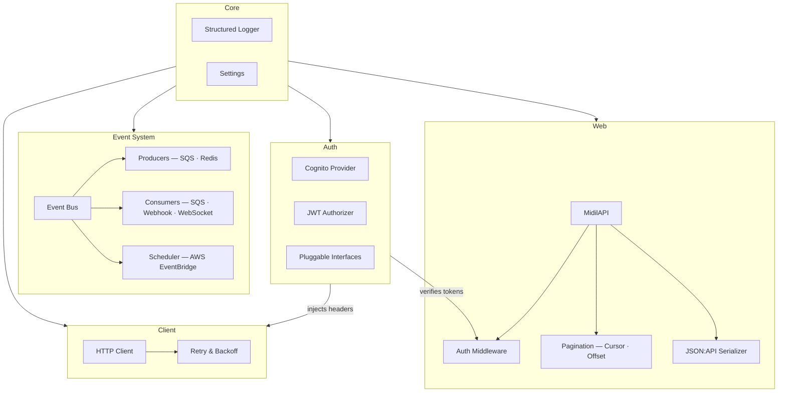
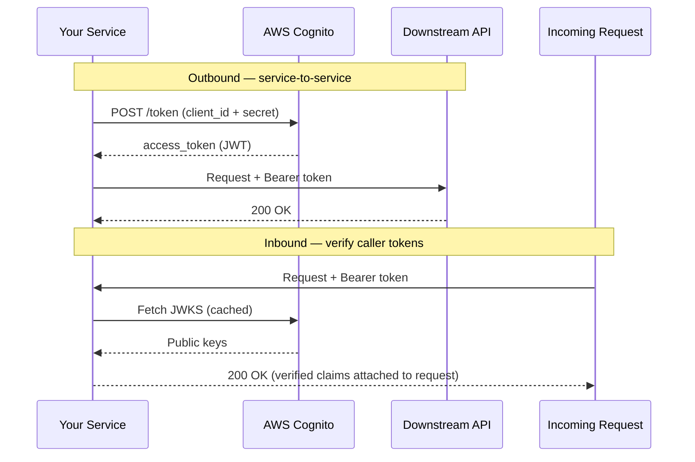
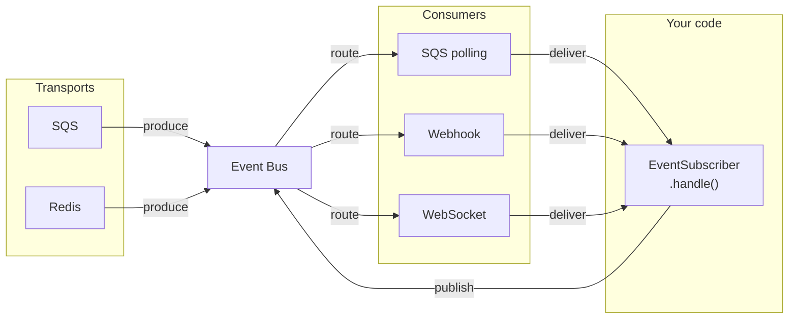

# MIDIL — Managed Interface for Data, Integration & Logic

**Backend infrastructure, as a Python SDK.**

MIDIL gives distributed backend systems a shared foundation — auth, eventing, HTTP, and API conventions — so teams spend less time rebuilding the same plumbing across every service.

[](https://pypi.org/project/pymidil/)
[](https://pypi.org/project/pymidil/)
[](LICENSE)

---

## Architecture

MIDIL is a collection of loosely coupled modules. Each can be used independently or composed:



---

## Install

```bash
pip install pymidil
```

MIDIL is modular. Install only what your service needs:

| Extra | Installs | Use when you need |
|---|---|---|
| `pymidil[auth]` | httpx, pyjwt | Cognito auth, JWT verification, HTTP client |
| `pymidil[web]` | fastapi, starlette, uvicorn | REST APIs, middleware, pagination |
| `pymidil[aws]` | aioboto3 | SQS consumers, EventBridge scheduling |
| `pymidil[redis]` | redis | Redis-backed event streaming |
| `pymidil[mongodb]` | pymongo | MongoDB cursor pagination |
| `pymidil[cli]` | click, rich, cookiecutter | Project scaffolding and service launcher |
| `pymidil[full]` | everything | — |

Requires Python 3.12+.

---

## Quick start

Auth, HTTP, and eventing wired together in one example:

```python
import asyncio
from pymidil.auth.cognito import CognitoClientCredentialsAuthenticator
from pymidil.client import HttpClient
from pymidil.event.event_bus import EventBus
from pymidil.event.subscriber.base import EventSubscriber
from pymidil.event.message import Message

class OrderHandler(EventSubscriber):
    async def handle(self, event: Message) -> None:
        print(f"Processing: {event.body}")

    async def on_error(self, event: Message, error: Exception) -> None:
        print(f"Failed: {error}")

async def main():
    auth = CognitoClientCredentialsAuthenticator(
        client_id="...",
        client_secret="...",
        cognito_domain="your-domain.auth.region.amazoncognito.com",
    )

    # Downstream call — auth headers injected automatically
    client = HttpClient(auth_client=auth, base_url="https://api.example.com")
    response = await client.send_request("POST", "/orders", data={"item": "widget"})

    # Publish the result through the event bus
    bus = EventBus()
    bus.subscribe(OrderHandler())
    await bus.publish(response.json())
    await bus.start()

asyncio.run(main())
```

---

## What's included

### Auth

Outbound machine-to-machine auth and inbound JWT verification, with a pluggable interface so you're not locked into any one provider.



```python
from pymidil.auth.cognito import CognitoClientCredentialsAuthenticator, CognitoJWTAuthorizer

# Outbound — get a token for service-to-service calls
auth = CognitoClientCredentialsAuthenticator(
    client_id="...",
    client_secret="...",
    cognito_domain="your-domain.auth.region.amazoncognito.com",
)
headers = await auth.get_headers()  # {"Authorization": "Bearer ..."}

# Inbound — verify tokens from incoming requests
authorizer = CognitoJWTAuthorizer(user_pool_id="...", region="us-east-1")
claims = await authorizer.verify(token)
```

---

### Event system

A transport-agnostic event bus. Swap between SQS, Redis, or webhooks through config — your handler code stays the same.



```python
from pymidil.event.event_bus import EventBus
from pymidil.event.subscriber.base import EventSubscriber
from pymidil.event.message import Message

class OrderPlacedHandler(EventSubscriber):
    async def handle(self, event: Message) -> None:
        ...

    async def on_error(self, event: Message, error: Exception) -> None:
        ...

bus = EventBus()
bus.subscribe(OrderPlacedHandler())

await bus.publish({"order_id": "abc-123"})
await bus.start()
```

Transport is configured through your service settings — no code change needed to switch from Redis to SQS in production.

---

### Scheduler

Emit one-off or future-targeted events using AWS EventBridge. No cron infrastructure to manage.

```python
from pymidil.event.scheduler.eventbridge import AWSEventBridgeScheduler
from datetime import datetime

scheduler = AWSEventBridgeScheduler(region="us-east-1")

# Emit an event immediately to an EventBridge bus
await scheduler.put_event(
    detail_type="order.placed",
    source="orders-service",
    detail={"order_id": "abc-123"},
    event_bus_name="default",
)

# Schedule a one-off event at a specific time
await scheduler.schedule_event(
    schedule_name="send-invoice-abc-123",
    endpoint="arn:aws:lambda:...",
    execution_time=datetime(2025, 6, 1, 9, 0),
    data={"invoice_id": "abc-123"},
    role_arn="arn:aws:iam::...",
)
```

---

### HTTP client

An HTTPX-based client with built-in retry, exponential backoff, and first-class auth integration.

```python
from pymidil.client import HttpClient

client = HttpClient(auth_client=auth, base_url="https://api.example.com")
response = await client.send_request("POST", "/orders", data={...})
```

Retry and backoff are configurable via your service settings — no subclassing needed.

---

### FastAPI extensions

Drop-in middleware and dependencies for auth and JSON:API-compliant responses.

```python
from fastapi import FastAPI, Depends, Request
from pymidil.web import MidilAPI
from pymidil.web.middleware.auth import CognitoAuthMiddleware, AuthContext
from pymidil.web.dependencies.jsonapi import parse_sort, parse_include

app = MidilAPI()  # FastAPI subclass with JSON:API exception handlers pre-wired
app.add_middleware(CognitoAuthMiddleware)

def get_auth(request: Request) -> AuthContext:
    return request.state.auth

@app.get("/orders")
async def list_orders(
    auth: AuthContext = Depends(get_auth),
    sort=Depends(parse_sort),
    include=Depends(parse_include),
):
    ...
```

---

### JSON:API

[JSON:API](https://jsonapi.org/) is a specification for structuring API responses — consistent shape, sparse fieldsets, relationship includes, and pagination links across every endpoint. MIDIL implements the spec so you don't have to hand-roll response envelopes:

```python
from pymidil.jsonapi import Document, ResourceObject

doc = Document(
    data=ResourceObject(
        id="1",
        type="orders",
        attributes={"status": "placed", "total": 99.00},
    )
)
```

---

### Logger

Structured, leveled logging with automatic sensitive-data masking.

```python
from pymidil.logger import setup_logger

log = setup_logger(level="INFO", enable_http_logging=False)
log.info("Order placed", order_id="abc-123", total=99.00)
# {"level": "INFO", "message": "Order placed", "order_id": "abc-123", "total": 99.00, ...}
```

---

## CLI

Scaffold and run services from the terminal.

```bash
midil init        # create a new service from a template (FastAPI or Lambda)
midil launch      # start the service with uvicorn
midil version     # show the installed SDK version
```

---

## Examples

Runnable examples are in [`examples/`](examples/). See the [examples README](examples/README.md) for a full list.

---

## Design principles

- **Async-first.** Every component is built for `asyncio` — no sync wrappers.
- **Opt-in by default.** Nothing is installed you didn't ask for.
- **Interface-driven.** Auth providers, event subscribers, retry strategies — all are abstract base classes you can swap or extend.
- **Convention over configuration.** Sane defaults, with escape hatches where it matters.

---

## Contributing

Open an issue or pull request on [GitHub](https://github.com/midil-io/pymidil). All contributions welcome.

---

## License

Apache 2.0 — see [LICENSE](LICENSE).
Built at [midil.io](https://midil.io).
